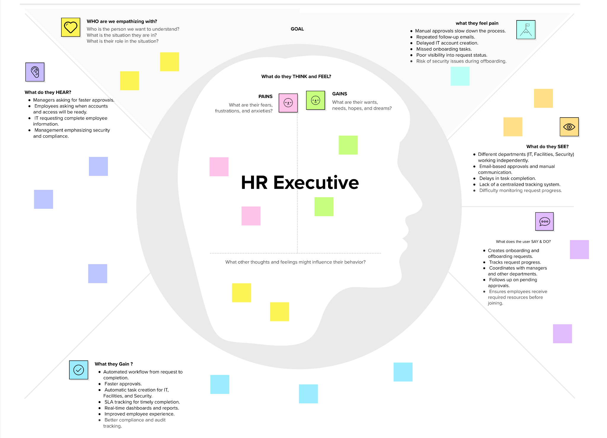

**Ideation Phase**

**Empathize & Discover**

| Date | 1 July 2026 |
| --- | --- |
| Project Name | Automated Employee Onboarding & Offboarding System using ServiceNow |

**Empathy Map Canvas:**

An empathy map is a simple, easy-to-digest visual that captures knowledge about a user’s behaviours and attitudes.

It is a useful tool to helps teams better understand their users.

Creating an effective solution requires understanding the true problem and the person who is experiencing it. The exercise of creating the map helps participants consider things from the user’s perspective along with his or her goals and challenges.

