# Automated Employee Onboarding & Offboarding System Using ServiceNow

# 1. Introduction

## 1.1 Project Overview

The **Automated Employee Onboarding & Offboarding System** is a ServiceNow-based workflow automation solution designed to streamline the complete employee lifecycle. Traditional onboarding and offboarding processes often involve manual coordination among HR, Managers, IT, Facilities, and Security departments, leading to delays, communication gaps, and reduced operational efficiency.

This project automates the entire process using **Service Catalog**, **Flow Designer**, **Custom Tables**, **Approval Workflows**, **Catalog Tasks**, **Service Level Agreements (SLAs)**, **Role-Based Access Controls (ACLs)**, **Reports**, and **Dashboards**. The system ensures that every employee request is processed through a standardized workflow, improving transparency, accountability, and compliance.

## 1.2 Purpose

The primary purpose of this project is to replace manual employee onboarding and offboarding activities with an automated digital workflow that improves efficiency, reduces processing time, and minimizes human errors.

The objectives include:

* Automate employee onboarding and offboarding requests.

* Eliminate manual task assignments.

* Route requests for manager approval automatically.

* Generate IT, Facilities, and Security tasks automatically.

* Monitor task completion using SLAs.

* Improve collaboration among departments.

* Provide HR with real-time dashboards and reports.

* Maintain secure access through role-based permissions.

# 2. Ideation Phase

The Ideation Phase focused on identifying the key challenges faced during employee onboarding and offboarding in organizations. Discussions were conducted to understand the difficulties experienced by HR, Managers, IT, Facilities, and Security teams in managing employee lifecycle activities manually. Various ideas were evaluated, and the most feasible solution was selected based on automation capability, scalability, business value, and ease of implementation.

Through customer problem analysis, empathy mapping, brainstorming, and idea prioritization, the project team identified that ServiceNow provides an ideal platform for automating employee lifecycle processes. The selected solution aims to improve efficiency, reduce manual effort, enhance transparency, and ensure timely completion of onboarding and offboarding activities through workflow automation.

The Ideation Phase includes:

* Problem Statement

* Empathy Map Canvas

* Brainstorming & Idea Prioritization

# 3. Requirement Analysis

The Requirement Analysis phase involved gathering and analyzing the functional and non-functional requirements of the proposed Employee Onboarding & Offboarding System. The objective was to understand business needs, stakeholder expectations, and system requirements to ensure that the solution addresses real organizational challenges.

During this phase, customer interactions, workflow analysis, and business processes were studied to define the complete employee lifecycle. A customer journey map was prepared to visualize the user experience, while solution requirements were identified to define the core functionalities and quality attributes of the system. The overall analysis served as the foundation for designing and implementing an automated workflow using the ServiceNow platform.

The Requirement Analysis phase includes:

* Customer Journey Map

* Solution Requirements

# 4. Project Design

## 4.1 Problem–Solution Fit

The proposed solution addresses delays and inefficiencies in manual employee lifecycle management by introducing workflow automation. ServiceNow automates request submission, approvals, task creation, tracking, and reporting, ensuring consistent execution across departments.

## 4.2 Proposed Solution

The solution uses the ServiceNow platform to automate employee onboarding and offboarding. HR submits requests through the Service Catalog, which are stored in a custom Employee Lifecycle Management table. Flow Designer routes the request for manager approval and automatically generates tasks for IT, Facilities, and Security. SLA monitoring, notifications, reports, and dashboards provide complete visibility into the process while ACLs ensure secure access to employee data.

## 4.3 Solution Architecture

### Components

* Service Portal

* Service Catalog

* Employee Lifecycle Management Custom Table

* Flow Designer

* Manager Approval

* IT Team

* Facilities Team

* Security Team

* SLA

* Reports

* Dashboard

# 5. Project Planning & Scheduling

The development was completed using the Agile methodology, structured into three main sprints. The project was broken down into epics and user stories, totaling 51 story points with an average velocity of 17 points per sprint.

## Sprint Breakdown

**Sprint 1: Roles, Security & Data Architecture (14 Points)**

* **Roles & Security:** Created roles for HR, IT, Facilities, and Security; created groups and assigned users; configured ACLs.

* **Data Architecture:** Created the custom Employee Lifecycle Management table; configured fields and form layouts.

**Sprint 2: Service Catalog & Flow Designer (18 Points)**

* **Service Catalog:** Developed Onboarding and Offboarding Catalog Items; configured variables and UI policies.

* **Flow Designer:** Created the Employee Lifecycle Flow and configured the manager approval process.

**Sprint 3: Task Automation, Monitoring & Reporting (19 Points)**

* **Task Automation:** Automated creation of IT, Facilities, and Security catalog tasks.

* **Monitoring & Reporting:** Configured SLAs, created reports, designed the HR Dashboard, configured notifications, and performed end-to-end testing.

# 6. Functional & Performance Testing

## Functional Testing

The following functionalities were successfully validated:

* Employee request creation

* Catalog variable validation

* Flow execution

* Manager approval

* IT task generation

* Facilities task generation

* Security task generation

* SLA tracking

* Reports

* Dashboard

## Performance Testing

The application was tested for normal operational usage.

Observations:

* Catalog submission completed successfully.

* Flow execution performed correctly.

* Tasks were generated automatically.

* Reports and dashboards updated successfully.

* No significant delays were observed during workflow execution.

# 7. Results

The developed solution successfully automated the employee onboarding and offboarding process.

Key achievements:

* Automated Service Catalog requests.

* Manager approval workflow.

* Automatic departmental task generation.

* Employee Lifecycle Management records.

* SLA tracking.

* Reports and dashboards.

* Secure access using ACLs.

## 7.1 Output Screenshots

1.Service Portal

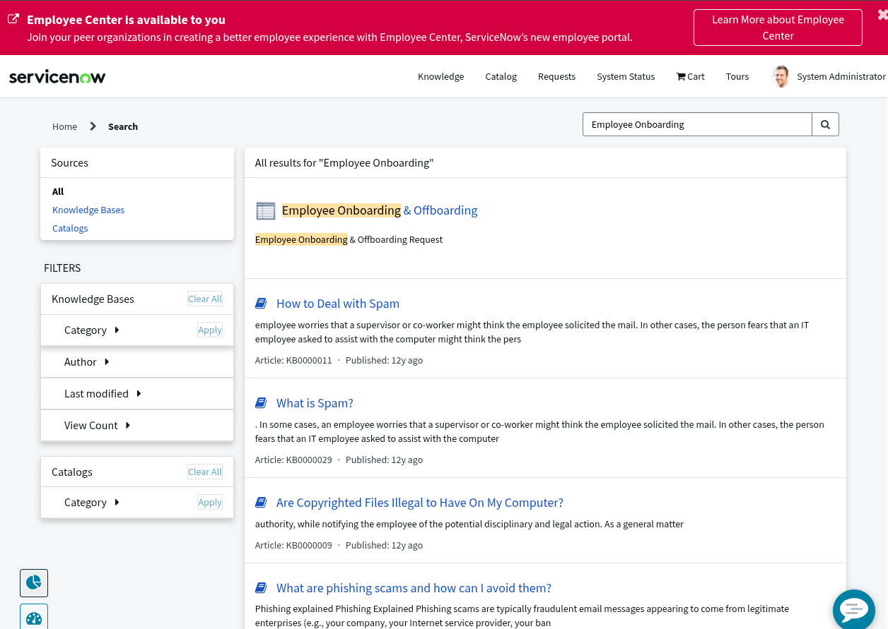

2.Employee Onboarding form

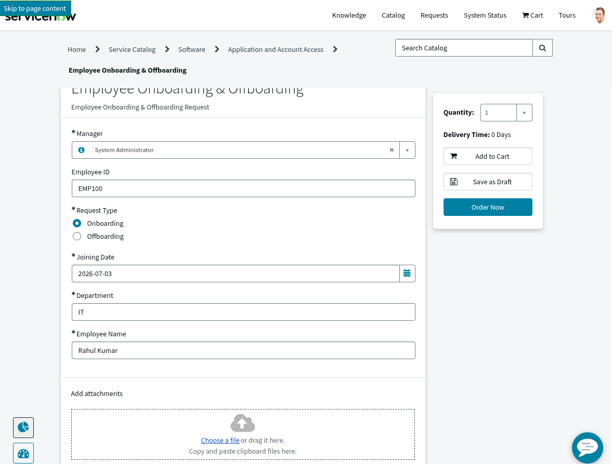

3.Request Summary

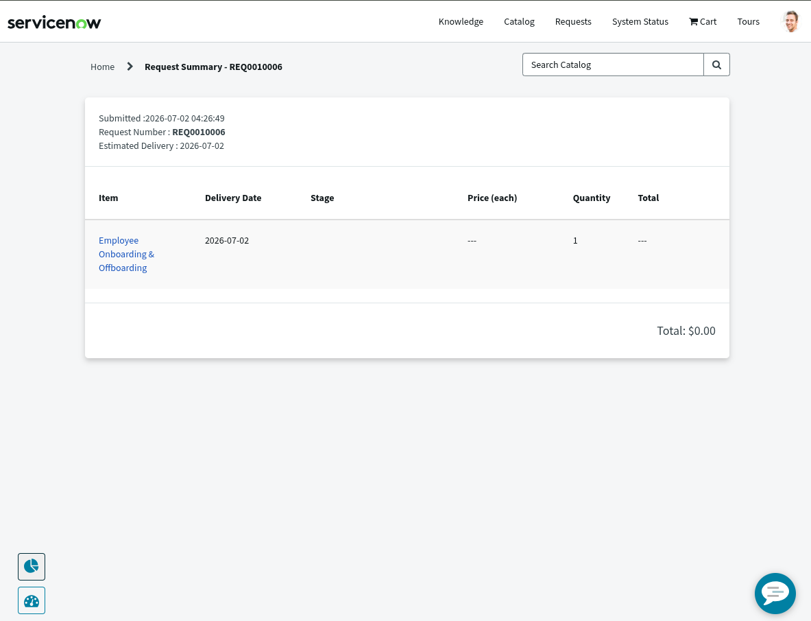

4.Employee Lifecycle Table

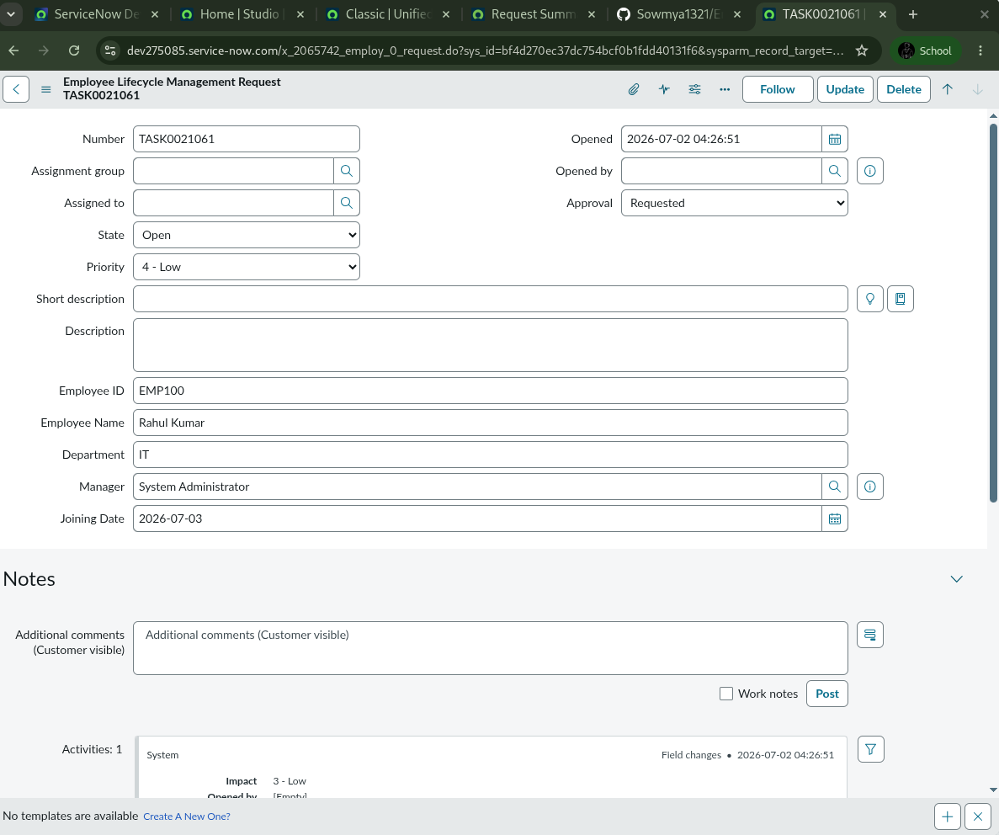

5.Approval List

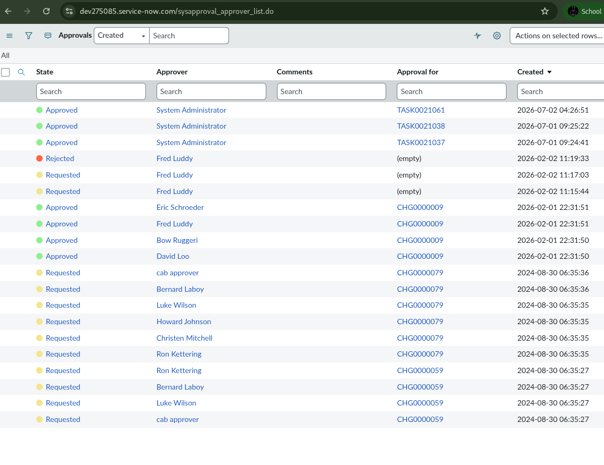

6.Catalog Tasks

7. Flow Designer

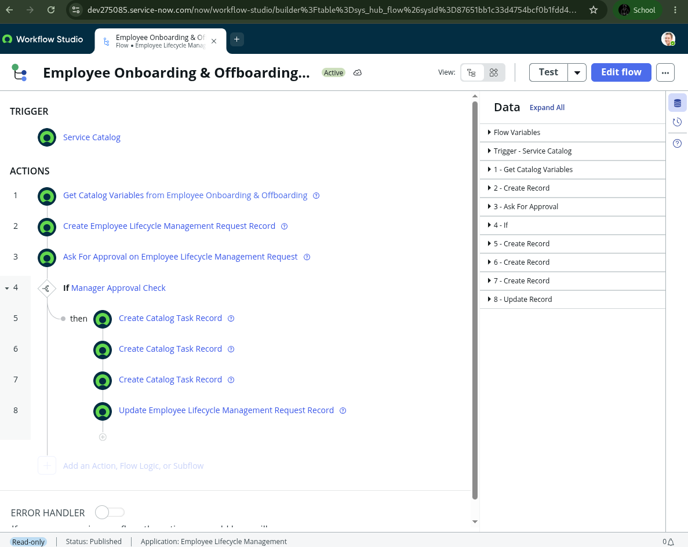

8.Service Catalog

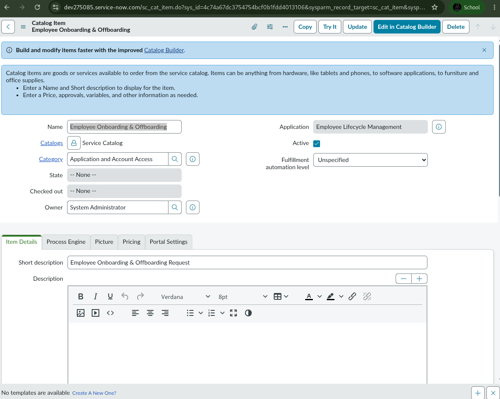

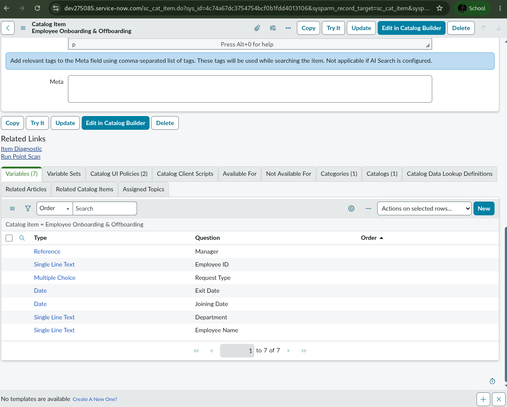

9. Custom Table

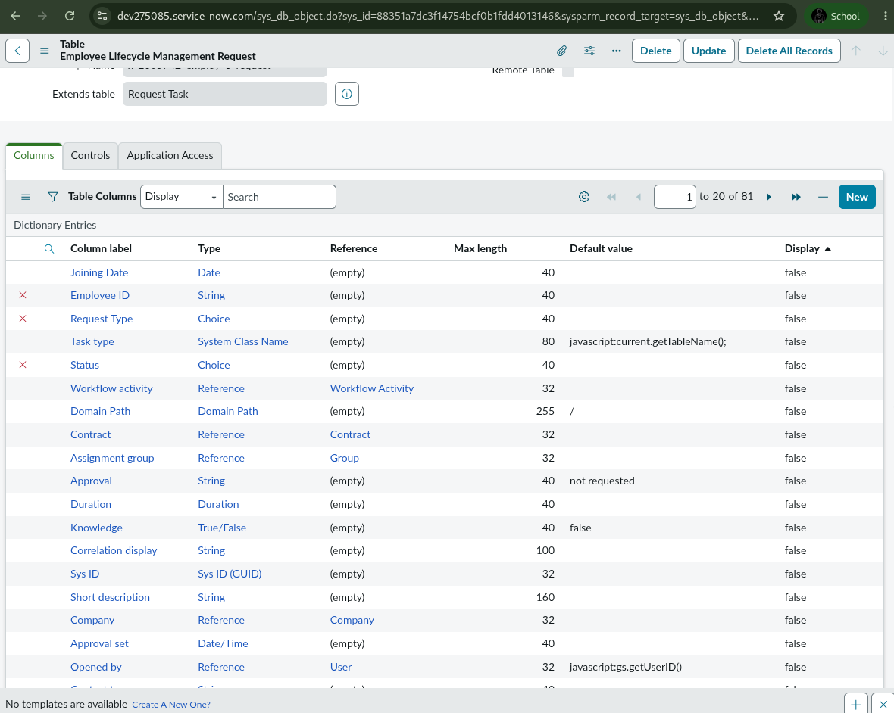

10.SLA

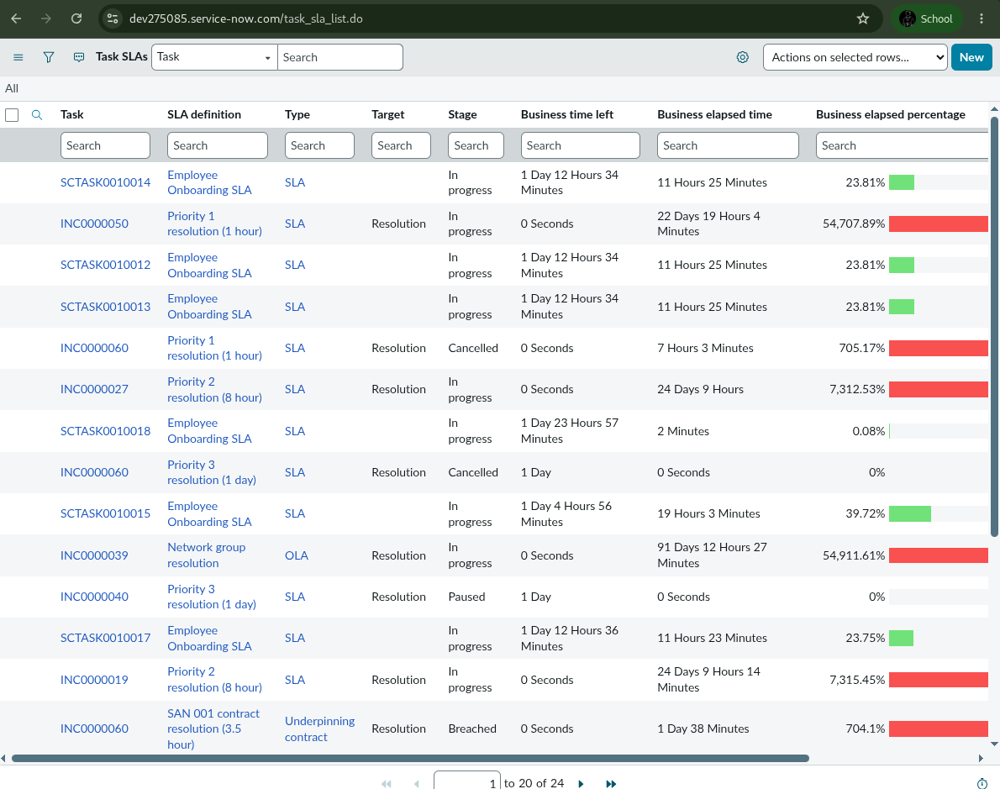

11. Reports

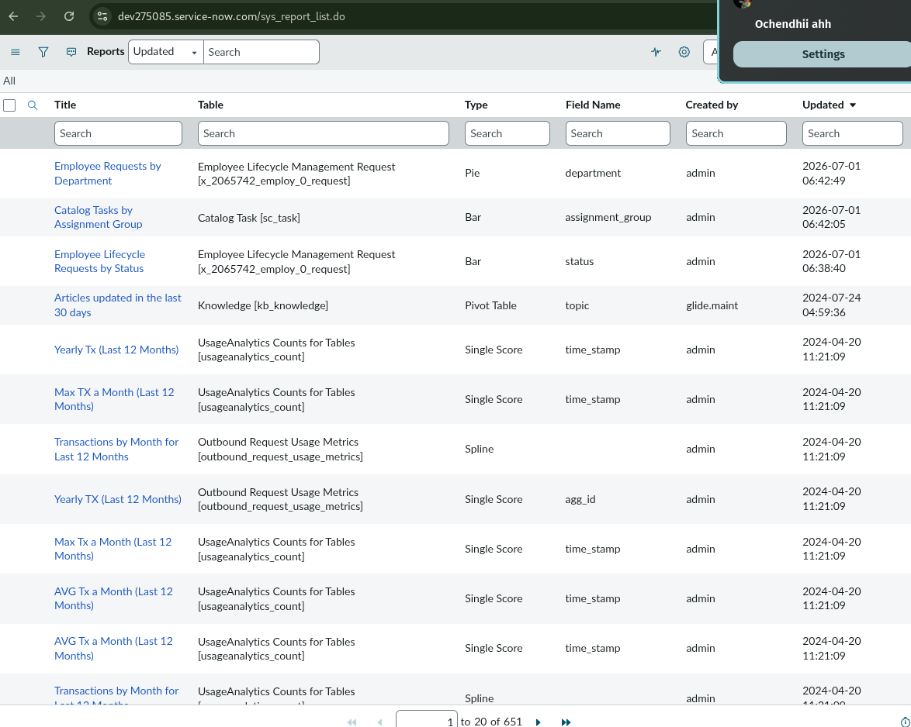

Dashboard

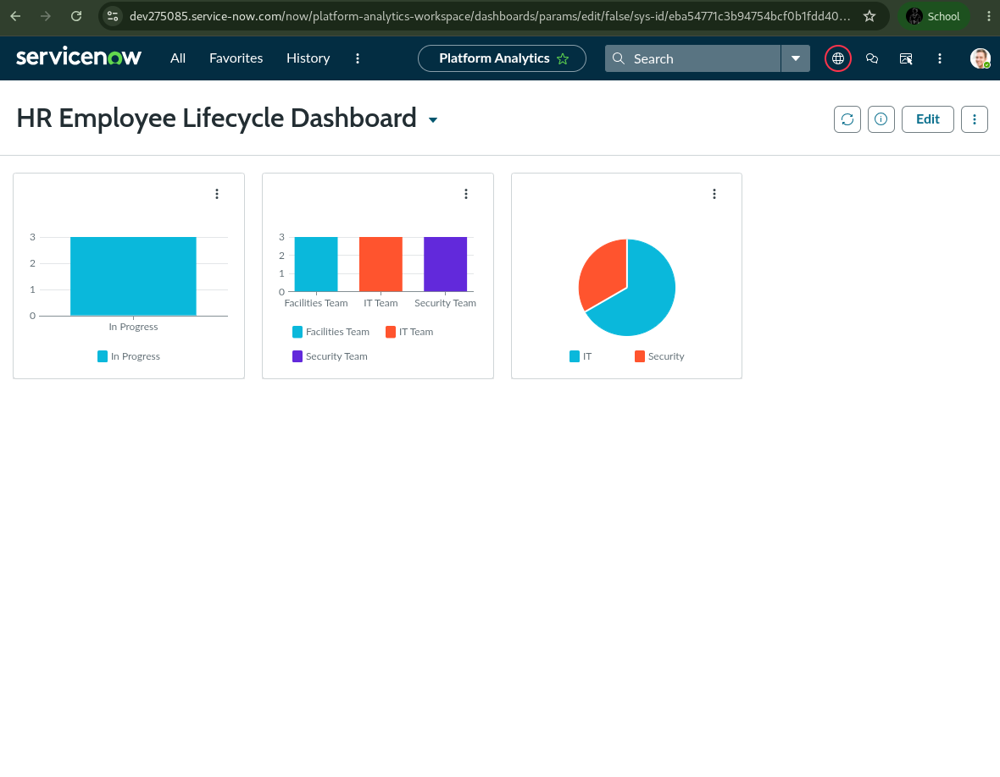

# 8. Advantages & Disadvantages

## Advantages

* Reduces manual effort.

* Faster onboarding and offboarding.

* Automated approvals.

* Automatic departmental task assignment.

* Centralized employee lifecycle tracking.

* Improved transparency.

* SLA monitoring.

* Better reporting and dashboards.

* Enhanced security through ACLs.

* Scalable workflow automation.

## Disadvantages

* Depends on ServiceNow platform availability.

* Initial configuration requires administrative knowledge.

* Additional integrations (HRMS, Active Directory) require further implementation.

* Users require basic training to use the system effectively.

# 9. Conclusion

The **Automated Employee Onboarding & Offboarding System** successfully simplifies employee lifecycle management by replacing manual processes with an automated ServiceNow workflow. The project demonstrates how ServiceNow's low-code capabilities can improve efficiency, collaboration, security, and transparency. The implemented solution fulfills the functional requirements and provides a scalable foundation for future enterprise HR automation.

# 10. Future Scope

Future enhancements include:

* Active Directory integration

* HRMS integration

* Employee asset management

* Mobile approvals

* AI-based request recommendations

* Integration with payroll systems

* Advanced analytics dashboards

* Multi-level approval workflows

* Integration Hub support

* Automated user provisioning

## GitHub Repository

https://github.com/chilakalapudisandeep/Automated-Employee-Onboarding-Off-boarding-System

## Project Demo Video

https://drive.google.com/file/d/1IjwmNrwuNMPpIjC6FVAKycy_EHMja5cg/view?usp=drivesdk