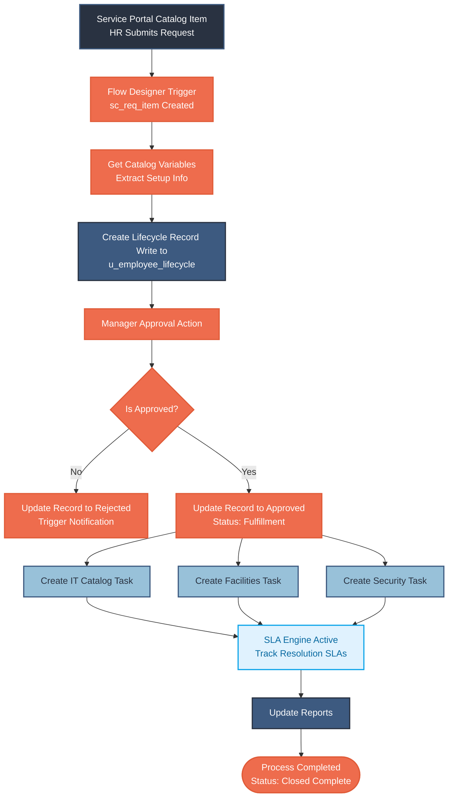
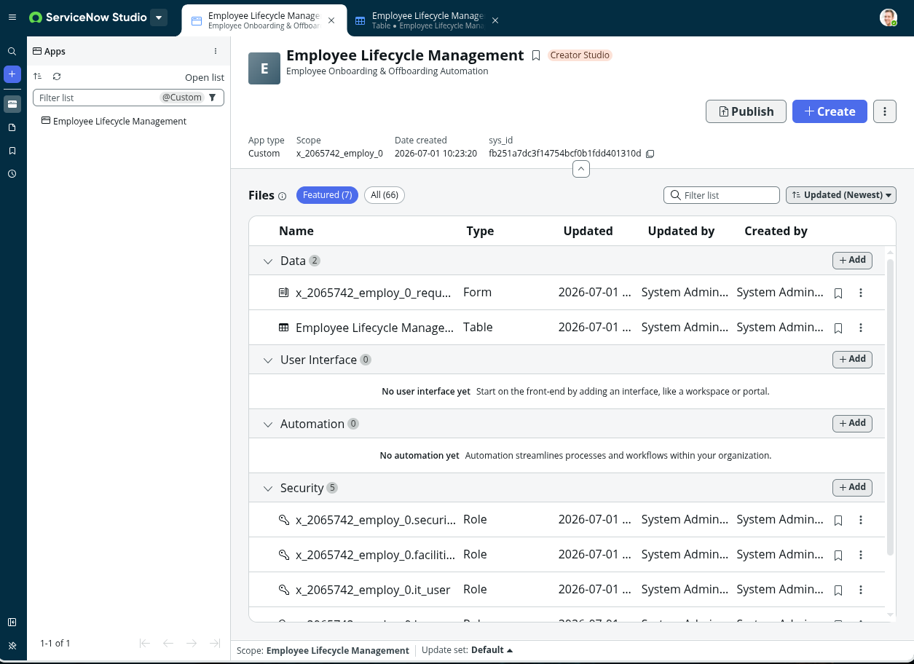
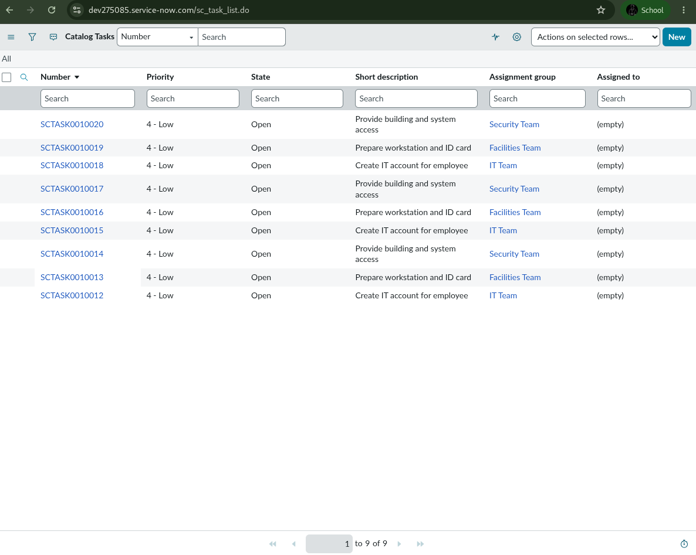
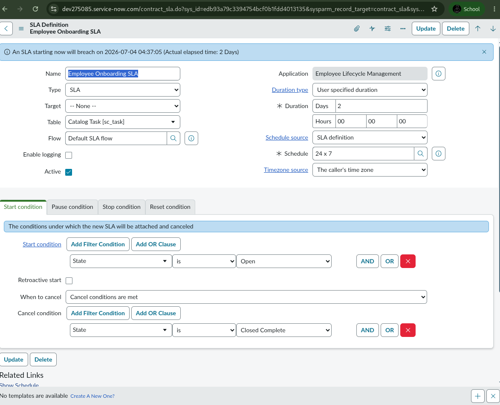

# 🚀 Automated Employee Onboarding & Off boarding System

[](https://www.servicenow.com/)
[](LICENSE)
[](https://github.com/)

An enterprise-grade ServiceNow custom application designed to automate and streamline the employee lifecycle. This system orchestrates HR requests, automates approval workflows, auto-provisions catalog tasks to cross-functional teams, tracks performance via Service Level Agreements (SLAs), and visualizes key metrics on custom Dashboards.

---

## 📌 Table of Contents

- [🔍 Project Description](#-project-description)
- [✨ Key Features](#-key-features)
- [🧩 ServiceNow Implementation Details](#-servicenow-implementation-details)
- [📐 System Architecture & Workflow](#-system-architecture--workflow)
- [📁 Repository Folder Structure](#-repository-folder-structure)
- [📸 Screenshots & Visuals](#-screenshots--visuals)
- [👥 Team & Roles](#-team--roles)

---

## 🔍 Project Description

In modern organizations, onboarding new hires and offboarding departing employees are highly manual, error-prone processes. This project solves these challenges by implementing an automated **Employee Lifecycle Management** system on the **ServiceNow** platform. The solution provides a unified Service Catalog interface for HR, which triggers a robust, automated workflow designed using **Flow Designer**.

---

## ✨ Key Features

*   **Self-Service Catalog Items:** Forms for Employee Onboarding and Employee Offboarding accessible via the ServiceNow Service Portal.
*   **Automated Lifecycle Record:** Auto-generation of tracking records in a custom table (`u_employee_lifecycle`) for complete auditability.
*   **Dynamic Flow Designer Logic:** Automated flow orchestrating approvals, data retrieval, and task routing.
*   **Parallel Catalog Task Creation:** Parallel dispatching of catalog tasks (`sc_task`) to IT, Facilities, and Security groups.
*   **Service Level Agreement (SLA) Tracking:** Resolution SLAs attached to catalog tasks to ensure accountability.
*   **Interactive Analytics & Dashboards:** Reports and visual gauges tracking open requests, pending approvals, and SLA statuses.

---

## 🧩 ServiceNow Implementation Details

The application leverages core ServiceNow components and custom-built objects:

*   **Custom Table:** `u_employee_lifecycle` (tracks candidate details, employee status, request type, and SLA states)
*   **Service Catalog:** Catalog items under the Human Resources category
*   **Flow Designer:** `Employee Lifecycle Orchestration Flow` triggered on request item (`sc_req_item`) creation
*   **Approval Engine:** Dynamic Routing to the employee's manager
*   **Catalog Tasks:** Generation of parallel tasks for IT, Facilities, and Security teams
*   **SLA Engine:** Standard resolution SLAs tracking time elapsed on fulfillment tasks

---

## 📐 System Architecture & Workflow

The system bridges the Service Portal UI with background fulfillment teams using a robust event-driven architecture:



---

## 📁 Repository Folder Structure

This repository is organized into phases and contains all project artifacts:

```text
├── README.md                          # Project overview and setup guide
├── 1.Ideation-Phase/                  # Define problem statements, brainstorming, and empathize docs
├── 2.Requirements-Analysis/           # Customer journey maps and solution requirements
├── 3.Project-Design-Phase/            # Solution architecture and proposed designs
├── 4.Project-Planning-Phase/          # Project plans and scheduling logic
├── 5.Project-Development-Phase/       # Development documentation
├── 6.Project-Documentation/           # Final project report and documents
└── Screenshots/                       # Visual proof of implementation (JPG images)
```

---

## 📸 Screenshots & Visuals

### 1. Service Portal Catalog Item View


### 2. Catalog Form Layout & Client Validation


### 3. Custom Employee Lifecycle Table Record


### 4. Active Flow Designer Blueprint


### 5. Manager Approval Interface


### 6. Parallel Fulfillment Catalog Tasks


### 7. Task SLA Timer & Tracking


### 8. Analytics & Reporting


### 9. Executive Dashboard View


---

## 👥 Team & Roles

*   **ServiceNow Developer & Solution Architect**
    *   *Responsible for configuration, custom table creation, flow design, SLA definition, client script logic, dashboards, and reporting on the ServiceNow platform.*
